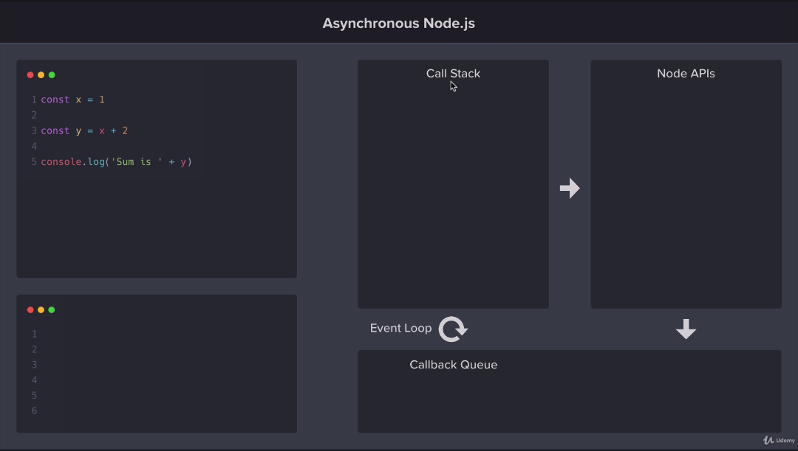

# Section 02: Installing and Exploring NodeJS

## Index

1. Intro: Installing and exploring Node.js
2. Installing Node.js and Visual Studio Code
3. What is Node.js?
4. Why should I use Node.js?

## 1. Intro: Installing and exploring Node.js
In this section, you’re going to set up your machine for the rest of the course. This includes installing Node.js and Visual Studio Code. This section also dives into what Node.js is, how Node.js works, and why Node.js is a tool worth learning.

## 2. Installing Node.js and Visual Studio Code
To install node you have the next options:

1. Download the installer from www.nodejs.org
2. Use a package manager to install apps in your Operative System.

After run the installer you can check that node is installed running the next command:

    node --version

Now that node is installed you need an editor to develop with NodeJS. The recommended editor is [VSCode](https://code.visualstudio.com).

## 3. What is NodeJS?

NodeJS is a runtime built with V8 JavaScript engine that allow us to run JavaScript code on the server side. This means that we can built web servers, command line interfaces and more.

### How NodeJS works?
The key to understand how NodeJS works is in the V8 JavaScript engine. This is the engine used by the Chrome browser and his work is compile JavaScript code into machine code. Let's deep in the context where the V8 engine have relevance.

The V8 engine is written in C++. This means that anyone can write a C++ application and incorporate the V8 JavaScript engine into the app. Sameway you could extend the functionality that JavaScript provide. This is exactly what Google Chrome and NodeJS do ,because both are written in C++.

An important concept is _runtime_. The runtime is a context that privides custom functionality for various tools and libraries specific to an environment. Then we can assure that Chrome has a runtime and Node JS has a different one.

The Chrome runtime provide V8 with several objects and functions that allow JavaScript developers in the Chrome browser to manipulate the DOM or handle events. Neither of those features makes sense for NodeJS, because in this context we don't have a DOM and we don't have events. Instead, the NodeJS runtime provides tools and libraries for JavaScript developers to setting up web servers integrating with the file system. To conclude, both, Chrome and NodeJS are just creating their own modified version of JavaScript.

In Summary, NodeJS is JavaScript in the server. This is possible because NodeJS uses the V8 JavaScript Engine to run all of the JavaScript code you provide. NodeJS is able to teach JavaScript new things by providing C++ bindings to V8. This allows JavaScript to do anything that C++ can do, like access to the file system.

## 4. Why Should I Use NodeJS?

The next are the adventages of use NodeJS:

+ Non Blocking I/O Model
+ Use Event Driven
+ `npm`, the largest ecosystem open source libraries in the world.

### Non Blocking I/O Model

First we will focus in the I/O. I/O stands for Input/Output and the node applications use it anytime to communicate with the outside world. Next we have some cases where we use the I/O communication:

+ The app needs to communicate with the local machine for reading data from a file on the file system.
+ The app needs to communicate with other server for querying a database to fetch records for a given user.

In any case the I/O operations take time, and we can manage this time in a non-blocking way. It means that in the example of the query to the database, while the application is waiting for a response we can do other things, it can continue to process other code and make other request.

The browsers implement this non-blocking model. Otherwise it would freeze up whenever an I/O operation is happening.

The next image put together a quick comparison between a blocking and a non-blocking code and share the time required to execute the same task:

> The task: Fetch two users, and execute a sum.

As you can see, the non-blocking case executes the task twice faster that the blocking code. Thanks to the non-blocking model NodeJS is lightweight and efficent.

### Event Driven
The event driven is the process of registering those callbacks and having them call when the I/O operation is done. This feature will be explored in detail later on, when we start to develop the node apps.
