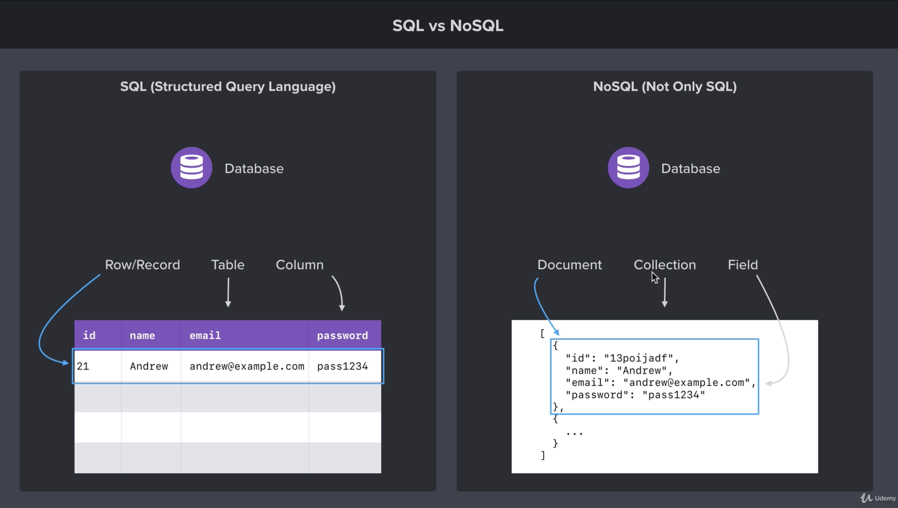

# Section 10: MongoDB and Promises

## Index
1. Intro: MongoDB
2. MongoDB and NoSQL Databases
3. Installing MongoDB on macOS
4. Installing Database GUI Viewer
5. Connecting and Inserting Documents
6. Inserting Documents
7. The ObjectID
8. Querying Documents
9. Promises
10. Updating Documents
12. Deleting Documents

## 1. Intro: MongoDB
Let's introduce databases in our Node.js application, Here we will learn how to connect to a MongoDB database from your Node.js application. This will allow us to store data in a secure and reliable fashion. To illustrate this relation, we will create a _Task Application_ that will use MongoDB to store user accounts as well as tasks.

## 2. MongoDB and NoSQL Databases
Before to start with MongoDB, it is necessary explore the NoSQL concept. NoSQL stands for _not only SQL_. The NoSQL databases are a bit different that traditional SQL databases such as MySQL. However, we can define the theory behind NoSQL from the SQL concepts. Please check carefully the next image:



As you can see, the notion of the database is the same for both proposals. The difference is in the way how the data is stored. In SQL databases we have the next hierarchy:

1. Table
2. Row/Record
3. Column

For the other hand, in NoSQL the scheme is:

1. Collection
2. Document
3. Field

With this base, we can start to go deep with MongoDB, that is a NoSQL database.

## 3. Installing MongoDB on macOS
To install MongoDB on macOS, you can download the [MongoDB Community Server](https://www.mongodb.com/download-center/community). The download is a zip file. Unzip the contents, change the folder name to "mongodb", and move it to your users home directory. From there, create a "mongodb-data" directory at the same level of your "mongodb". This directory will store the database data.

Now, you can start the mongodb server using the following command:

```
/Users/{username}/mongodb/bin/mongod --dbpath=/Users/{username}/mongodb-data
```

This command will generate some contents inside the `~/mongodb-data` and also you will see an output in the terminal like:

```
NETWORK  [initandlisten] waiting for connections on port 27017
```

### Links
- [MongoDB download page](https://www.mongodb.com/download-center/community)

## 4. Installing Database GUI Viewer
The GUI (Graphic User Interface) that we will setup is Robo 3T. Robo T3 is a MongoDB admin tool that makes easy to manage and visualize the data in your database.

Robo 3T is a completely free MongoDB admin tool.

### Links
- [Robo 3T download page](https://robomongo.org/)

## 5. Connecting and Inserting Documents
Let's to connect your MongoDB database with a Node.js application, and then, insert documents into the database to save them for later.

### Connecting to MongoDB
MongoDB provides a native driver that allows you to connect to the database. You just need to provide two pieces of information. The first is the connection URL and the second is the name of the database. You can pick any database name that you like, but I suggest chose a coherent one.

```js
const mongodb = require("mongodb");
const MongoClient = mongodb.MongoClient;

const connectionURL = "mongodb://127.0.0.1:27017";
const databaseName = "task-manager";

MongoClient.connect(connectionURL, { useNewUrlParser: true }, (error, client) => {
    if (error) {
        return console.log("Unable to connect database");
    }

    const db = client.db(databaseName);

    // Start to interact with the database
});
```

### Inserting a doument
With the connection open, you are ready to insert documents to the database. Remember that a database is made up of collections, and collections are used to store documents. The code below inserts a new document into the "users" collection. `db.collection` is used to get a reference to the collection you are trying to manipulate. `insertOne` is used to insert a new document into that collection.

```
db.collection('users').insertOne({
    name: "Edward",
    age: 27
})
```

### Links
+ [npm:mongodb](https://www.npmjs.com/package/mongodb)
+ [MongoDB driver documentation](http://mongodb.github.io/node-mongodb-native/3.1/api/)

## 6. Inserting Documents

## 7. The ObjectID

## 8. Querying Documents

## 9. Promises

## 10. Updating Documents

## 12. Deleting Documents
