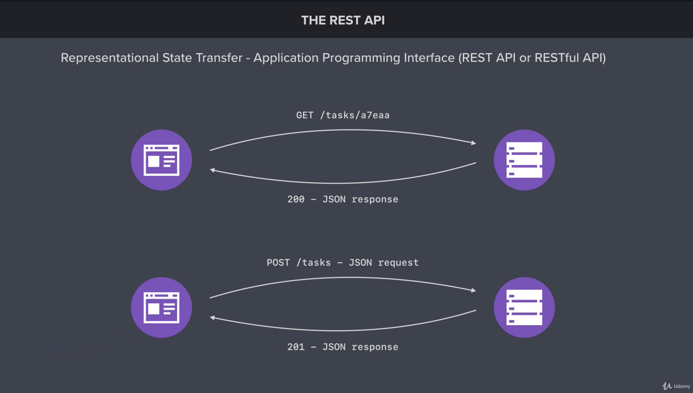
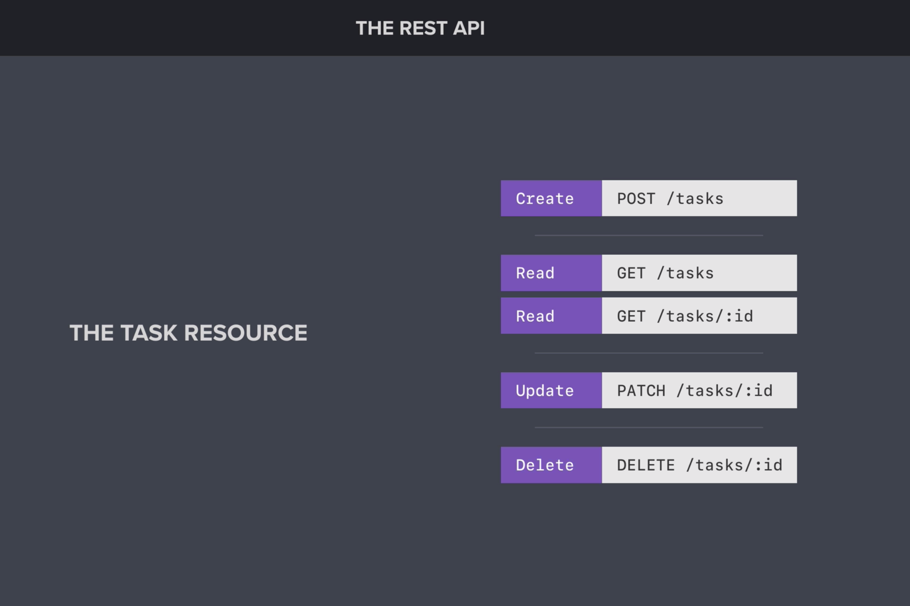
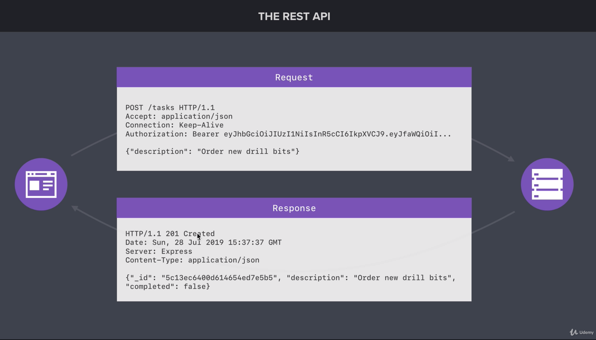

# Section 11: REST APIs and Mongoose

## 1. Intro: Mongoose
It is time to create a REST API using Express. You will learn what exactly a REST API is and how it can be used as the back-end for a web or mobile application. This section also covers data validation, application architecture, async/await, and more.

## 2. Setting up Mongoose
Mongoose makes it easy to model and manage your application data. This includes data sanitization, data validation, and more. Mongoose will serve as a replacement for the native driver, providing you a more object oriented interface.

### Setting up Mongoose
First up, install Mongoose

```
npm install mongoose@5.3.16
```

Like the MongoDB native driver, Mongoose provides a `connect` function you can use to connect to your MongoDB database.

```js
const mongoose = require('mongoose');

mongoose.connect("mongodb://127.0.0.1:27017/task-manager-api", {
    useNewUrlParser: true,
    useCreateIndex: true,
});
```

### Modeling Your Data
The core feature of Mongoose is the ability to model your data. A new model can be created for the different types of data your application needs to store. You can create as many models as your application needs.

The code below defines a user mode. The model definition is where you defines what makes up a user. This would include all the pieces of data you want to store in the database. The user model below has just two fields, a name and an age.

```js
const User = mongoose.model("User", {
    name: {
        type: String,
    },
    age: {
        type: Number,
    }
});
```

With the model defined, it is time to start creating and saving users. The `User` variable above stores the Mongoose model. This is a constructor function that can be used to create new users. The next snippet create a new user with the name `Sergio` and the age 27. This alone won't save any data to the database, but it is a step in the right direction.

```js
const me = new User({
    name: "Sergio",
    age: 27,
});
```

The new model instance can be saved to the database using the `save` method.

```js
me.save().then(() => {
    console.log(me);
}).catch((error) => {
   console.error("Error!", error)
})

```

### Links
+ [Mongoose](https://mongoosejs.com/)

## 3. Creating a Mongoose Model
Let's define the model for a Task. So, with the help of the notes in the section two, let's create a Task model with a description and a completed fields. The result is:

```js
const Task = mongoose.model("Task", {
    description: {
        type: String,
    },
    complete: {
        type: Boolean,
    },
});

const taskOne = new Task({
    description: "Clean my desk",
    complete: false,
});

taskOne.save().then(() => {
    console.log(taskOne);
}).catch((error) => {
    console.log("Error!", error);
});

```

## 4. Data Validation and Sanitization, Part I
Time to set up data validation and sanitization for our models. _Validation_ will allow you to restrict what data can be stored in the database, while _sanitization_ will allow you to store user data in a uniform and standardized way.

### Data Validation and Sanitization
First up, install validator. While Mongoose provides basic tools for performing validation, the validator library provides useful methods for validating data such as email addresses, phone numbers, zip codes, and more.

```
npm i validator@10.9.0
```
Mongoose comes with support for basic validation and sanitization. The user model below shows how this can be configured. `required` is used to validate that a value is provided for a given field. `trim`, is used to remove extra spaces before or after data. `lowercase` is used to convert the data lowercase before saving it to the database. You can find a complete list of options in the schema documentation.

You can also define custom validation for your models. This is done using `validate` as shown in the example below. The method gets called with the value to validate, and it should throw an error if the data is invalid. The next snippet uses the `isEmail` method from validator to validate the email address is valid before saving it to the database.

```js
const mongoose = require('mongoose')
const validator = require('validator')

const User = mongoose.model('User', {
    name: {
        type: String,
        required: true,
        trim: true
    },
    email: {
        type: String,
        required: true,
        trim: true,
        lowercase: true,
        validate(value) {
            if (!validator.isEmail(value)) {
                throw new Error('Email is invalid')
            }
        }
    }
})
```

### Links
+ [Schema](https://mongoosejs.com/docs/schematypes.html)
+ [npm: validator](https://www.npmjs.com/package/validator)

## 5. Data Validation and Sanitization, Part II
It is up to you to add validation and sanitization to the task model. We suggest left the description field mandatory, and the complete field optional but assign `false` as default value.


You will also be defining a new field on the user model with validation and sanitization of its own. This new field is password, so it is recommendable to add a validation of a minimum of 7 characters and avoid to include the password word in this field.

## 6. Structuring a REST API
First we will to define the acronyms. REST stands for Representational State Transfer and API stands for Application Programming Interface. So, let's start with API. An API is nothing more than a set of tools that allow you to build a software application. It is very broad term so, we could say that node provide us the eyes for the API. Also, we could say that our `npm` modules like express provides us with a set of tool that allows to build software application.

Now let's move on REST. REST is often described as an architecture style whose goal is the examination of the Internet as a stateless service of near-limitless expansion model with a simple but effective information delivery system. So we can reduce the concept like a set of formal and informal guides to create constraints. One of the core relations in an REST architecture is the **Client/Server** communication, like illustrates the next image.



When we use REST style an application can interact with resource by knowing only to things:

+ Identifier of the resource
+ Action to be performed on the resource

A resource is the consolidation of the domain that groups the data. In our case the Tasks and the Users are resources. The next image is a definition of the tasks resource:



The action to be performed on the resource is achieved with HTTP verbs which are equivalent to the CRUD operations that we perform before in the database.

Another important concept in REST is **stateless**. This means, that each request from the client to the server must contain all of the information necessary to understand the request, and cannot take advantage of any stored context on the server. _Session state is therefore kept entirely on the client._


In the other hand it is useful to know the template of the request document (from the client to the server) and the response document (from server to client). The next image show the headers, the status code and the information that is relevant in the transfer operations between the client and the server.



If you mix both concepts, REST API, we can conclude the it is a combination that allows clients like web applications to access and manipulate resources using a set of predefined operations to build software applications.

## 7. Installing Postman

Postman makes it easy to test your REST API by providing you with a set of tools for making HTTP requests. This is not meant to serve as a replacement for a web mobile application, it is just a useful way to debug your endpoints as you are creating them.

### Links
+ [Postman](https://www.getpostman.com/)

## 8. Resource Creation Endpoints, Part I
Let's create REST API endpoints for creating resources. This will allow users of the API to create new users and new tasks.

### Resource Creation Endpoints
Resource creation endpoints use the POST HTTP method. The URL structure is `/resources`. If you wanted to create a user, it would be `POST /users`. If you wanted to create a task, it would be `POST /tasks`.

The code below uses `app.post` to set up a POST request handler for `/users`. The handler function creates a new instance of the user model and saves it to the database.

`express.json` is also setup to parse incoming JSON into JavaScript object with you can access on `req.body`.

```js
app.use(express.json());

app.post('/users', (req, res) => {
    const user = new User(req/body)

    user.save().then(() => {
        res.send(user)
    }).catch((error) => {
       res.status(400).send(error)
    })
})
```

## 9. Resource Creation Endpoints, Part II
The part two corresponds to the creation of the endpoint for the `/tasks` resources. The idea here is apply the same steps that we did in the creation of the `/users` endpoint. Additionally, we will add semantic to our communications with help of the HTTP statuses code. When we create a resource, the proper code to use is the 201. In that case the post request will be like:

```js
app.post('/tasks', (request, response) => {
    const task = new Task(request.body);

    task.save().then(() => {
        response.status(201).send(task);
    }).catch((error) => {
        response.status(400).send(error);
    });
});
```

In summary the steps to execute are:
1. Move the resource model to the `/models` directory.
2. Import the model in the `index.js` file.
3. Set the `app.post` request for the resource in `index.js`
4. Add the request to the respective collection in Postman
5. Test your work.

### Links
+ [HTTPstatuses](https://httpstatuses.com)

## 10. Resource Reading Endpoints, Part I
Let's create REST API endpoint for reading resources. Twhi will allow users of the API to fetch users and tasks from the database.

### Resource Reading Endpoints
Resources reading endpoints use the GET HTTP method. The URL structure is `/resources` for a list of resources and `/resources/:id` for fetching an individual resource by its ID. If you wanted to fetch all your tasks, it would be `GET /tasks`. If you wanted to fetch an individual task with the id 198, it would be `GET /tasks/198`.

The code below uses `app.get` to set up a GET request for `/users/:id`. `:id` serves as a placeholder for the id of the user to fetch. If the request is `GET /users/321`, then the id will be 321. This is know as a URL parameter, and you can access the value for the URL on `req.params`

```js
app.get('/users/:id', (request, response) => {
    const _id = request.params.id;

    User.findById(_id).then((user) => {
        if (!user) {
            return response.status(404).send();
        }

        response.send(user);
    }).catch((error) => {
        response.status(500).send(error);
    });
});
```
### Links
+ [Express route parameters](http://expressjs.com/en/guide/routing.html#route-parameters)

## 11. Resource Reading Endpoints, Part II
In summary the steps to create the reading endpoint for tasks are:

1. Import the model in the `index.js` file.
2. Set the `app.get` with the `/tasks` request for the resource in `index.js`
2. Set the `app.get` with the `/tasks/:id` request for the resource in `index.js`, and check if a result is received.
3. Add the request to the respective collection in Postman
4. Test your work.

## 12. Promises Chaining
Time to explore the promise chaining. Promise chaining is a syntax that allows you to chain together multiple asynchronous tasks in a specific order. This is great for complex code where one asynchronous task needs t be performed after the completion of a different asynchronous tasks.

### Promise Chaining
To demonstrate promise chaining, the following function will be used to simulate an asynchronous tasks. In reality, it is just adding up a couple of numbers, waiting two seconds, and fulfilling the promise with the sum.

```js
const add = (a, b) => {
    return new Promise(resolve, reject) => {
        setTimeout(() => {
            if (a < 0 || b < 0) {
                return reject("Numbers must be non-negative")
            }
            
            resolve(a + b)
        }, 2000)
    }
}
```

With this dummy asynchronous function defined, promise chaining can be used to call `add` twice. The code below adds up `1` and `2` for a total of `3`. It then uses the sum of `3` as the input for the another call `add`. The second call to `add` adds up `3` and `4` for a total of `7`.

Promise chaining occurs when the `then` callback function returns a promise. This allows you to chain on another `then` call which will run when the second promise is fulfilled. `catch` can still be called to handled any errors that might occur along the way.

```js
add(1, 2).then((sum) => {
    console.log(sum) // Will print 3
    return add(sum, 4)
}).then((sum2) => {
    console.log(sum2) // Will print 6
}).catch((e) => {
    console.log(e)
})
```

## 13. Promises Chaining Challenge
And interesting feature of mongoose is that if you check his API, several methods returns promises. It means that we can apply the promise chaining in the context of the actions that we are performing over the database.

Below I share the steps to check how we can use promises chaining in out task app.

1. Create a playground file.
2. Load in mongoose for the database connection.
3. Load in the Task model.
4. Given an ID remove a task.
5. Print the total number of incomplete tasks.
6. Test your work.

Steps 4 and 5 will be achieved with promises chaining. The code below illustrates this description.

```js
require('../src/db/mongoose');

const Task = require('../src/models/task');

Task.findByIdAndDelete("5e28b2d57f12445cab486728").then((task) => {
    console.log(task);

    return Task.countDocuments({ completed: false });
}).then(countResult => {
    console.log(countResult);
}).catch((error) => {
    console.log(error);
});
```

## 14. Async/Await, Part I

## 15. Async/Await, Part II

## 16. Integrating Async/Await

## 17. Resource Updating Endpoints, Part I

## 18. Resource Updating Endpoints, Part II

## 19. Resource Deleting Endpoints

## 20. Separate Route Files
