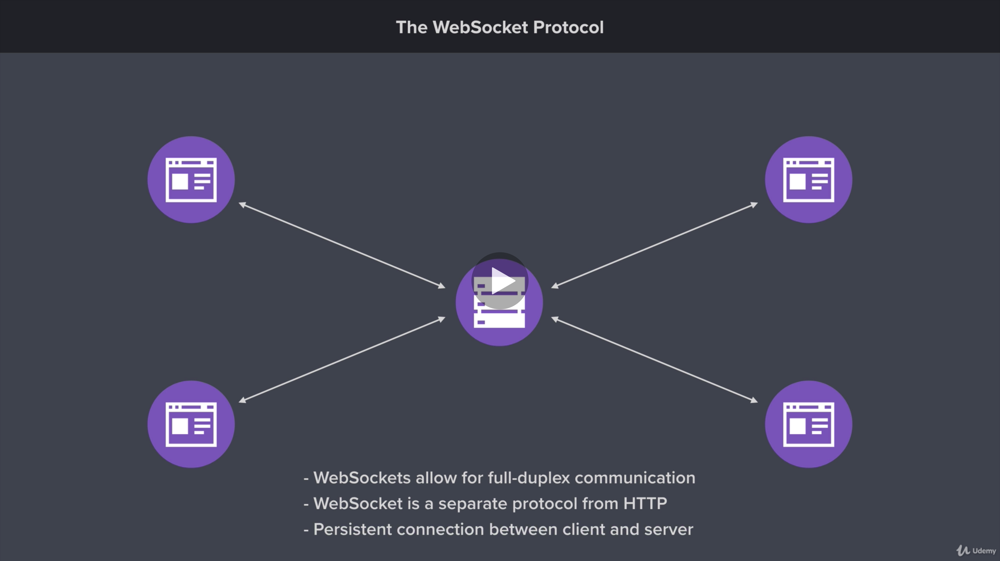

s
# Section Intro: Real-Time Web Applications with Socket.io

## 1: Section Intro: Real-Time Web Applications with Socket.io
Time to learn how to create real-time web applications with Node. The non- blocking nature of Node makes it well-suited for real-time applications such as chat apps, social media apps, and more.

## 2: Creating the Chat App Project
In this lesson it’s on you to set up the chat application web server.

The goal is to give you experience using what was covered in previous lessons. (You can check the web server project as guidance)

## 3. Web Sockets
The web socket protocol is used to create real time applications. Keep in mind that you can use web sockets with other programming languages as well. But in this case we will use the protocol with NodeJS to create a chat application.

Similar to HTTP, web socket protocol is going to allow us to setup communication between server and clients. So, the server start the application and from here clients will can connect with the server. I might have one client connect, or I might have several clients as well. In the next image you will see a scenario of one server and four clients with a list of the features that the web socket protocol offers us:



The first feature able with the web socket protocol is the **full duplex communication**. It is a fancy term for bi directional communication which means, that the client can initiate communication with the server and the server can initiate with the client. This is something that the HTTP protocol had not, because there the client is the only one who can initiate the communication, then the server responds. The server could not send data to the client if the client did not make a HTTP request before.

The second detail is that **web socket protocol is separate protocol from HTTP**. This means that the web socket protocol have different behaviors than HTTP.

The last feature is that we have **persistent connection** which means that all the clients connect to the server, and stays it connected for as long as it needs to.

To conclude this lesson, less show an example of a chat application in the next image:


In this case we start with a client active, and three clients in hold. First, we're going from client to the server and we're sending a new message across. So this particular user has typed something in the input field they've clicked the submit button to post the message to the chat room and that message goes from the client to the server. Now when the server gets the message it could do nothing. It could just print it to the terminal or do something else like dump it to a file on the file system. But what we really want to do is bring our other three clients into the mix. So the client has sent a message to the server.

The next thing we're gonna do is make sure that everyone else connected to that chatroom actually sees the message that this person typed. So right here we'll go ahead and bring those three clients into the mix. And this time we're also going to send some data around this time though it's going to go from the server to the client something we were not able to do in the past. So right here the server has said to this client I have a message from another user. It's going to send that message across to the client and the client can it in the browser the exact same thing is going to happen with our other two clients as well.

## 4. Getting Started with Socket.io
Time to setup the socket.io library. Socket.io comes with everything needed to set up a Web Socket server using Node.

### Socket.io on the Server
First up, install the modules

```
npm install socket.io@2.0.20
```

Socket.io can be used on its own or with Express. Since the chat app will serving up client-site assets, both Express and Socket.io will get set up. The server file below show how to get this done.

```js

const express = require('express');
const http = require('http');
const socketio = require('socket.io');
const path = require('path');

// Create the Express application
const app = express();

// Create the HTTP server using the Express application
const server = http.createServer(app);

// Connect Socket.io to the HTTP Server
const io = socketio(server);

const port = process.env.PORT || 3000;
const publicDirectoryPath = path.join(__dirname, '../public');

app.use(express.static(publicDirectoryPath));

// Listen for new connections to Socket.io
io.on('connection', () => {
    console.log('New web socket connection');
});

app.listen(port, () => {
    console.log('Server is up on port 3000');
});
```

The server above uses `io.on` which is provided by Socket.io. `on` allows the server to listen for an event and respond to it. In the example above, the server listens for `connection` which allows it to run some code when a client connects to the WebSocket server.

### Socket.io on the Client
Socket.io is also used on the client to connect to the server. Socket.io automatically serves up `/src/socket.io/socket.io.js` which contains the client-side code. The script tags below load in the client-side library followed by a custom JavaScript file.

```js
<script src="/socket.io/socket.io.js"></script>
<script src="/js/chat.js"></script>
```

You client-side JavaScript can the connect to the Socket.io server by calling `io`. `io` is provided by the client-side socket.io library. Calling this function will setup the connection, and it will cause the server `connection` event handler to run.

### Links
+ [https://socket.io/](Socket.io)

## 5. Socket.io Events
Time to learn how to work with events in Socket.io. Events allow you to transfer data from the client to the server.

### Working with Events
There are two side to every event, the sender and the receiver. If the server is the sender, then the client is the receiver, and vice versa. Events can be sent from the sender using `emit`. Events can be received by receiver using `on`. The example below shows how this pattern can be used to create a simple counter application. The following snippet contains the client-side JavaScript code.

```js
const socket = io();

// Listen the 'COUNT_UPDATED' event
socket.on('COUNT_UPDATED', (count) => {
    console.log('The count has been updated', count);
});

document.querySelector('#plus-one').addEventListener('click', () => {
    console.log('Clicked');
    // Listen the 'INCREMENT' event
    socket.emit('INCREMENT');
});
```

The client6 code uses `on` to listen for the `COUNT_UPDATED` event. A message will be logged with the current count when that event is received. The client-side code also uses `emit` to sen the `INCREMENT` event. This occurs when a button on the screen is clicked.

The server-side code for this example is below.

```js

let count = 0;

io.on('connection', () => {
    console.log('New web socket connection');
    socket.emit('COUNT_UPDATED', count);

    socket.on('COUNT_INCREMENTED', () => {
        count ++;
        // socket.emit('COUNT_UPDATED', count)
        io.emit('COUNT_UPDATED', count);
    });
});
```
The server above is responsible for emitting `COUNT_UPDATED` and listening for `INCREMENT`. New users get the current count right after they connect to the server. If a client sends `INCREMENT` to the server, the count is incremented and all connected clients are notified of the change.

On the client, `socket.emit` emits an event to the server. On the server, both `socket.emit` and `io.emit` can be used. `socket.emit` sends an event to that specific client, while `io.emit` sends an event to all connected clients.

## 6. Socket.io Events Challenge
To consolidate the explanation in the last lesson we will define two challenge:

### One: Event to send welcome message
Goal: Send a welcome message to new users

- Have server emit "message" when new clients connect
- Have client listen for "message" event and print the message to console
- Test your work

### Two: Event to send message between users
Goal: Allow clients to send message

- Create a form with and input and a button
- Setup event listener for form submissions
- Have server listen to the `SEND_MESSAGE` event
- Test your work

## 7. Broadcasting Events
Time to learn about broadcast events. Broadcasted events are sent to all connected clients, expect for the client that initiated the broadcast.

### Broadcasting Events
Events can be broadcasted from the server using `socket.broadcast.emit`. This event will get sent to all sockets except the one that broadcasted the event. The code below shows this off. When a new user joins to the chat application `socket.broadcast.emit` is used to send a message to all users that someone new has joined.

```js
io.on('connection', (socket) => {
    socket.broadcast.emit('message', 'A new user has joined!')
})
```

To identify if a user left the chat room, we should use the `socket.on` method inside the `connection` event with a subscription to the `disconnect` event. The snippet below shows the relation between the connection and disconnections of the chat app.

```js
io.on('connection', (socket) => {
    ...

    socket.on('disconnect', () => {
        io.emit('MESSAGE', 'A user has left!');
    });
})
```

## 8. Sharing Your Location
Let's integrate the Geolocation API into the chat app. This will allow users to share their locations in real time.

### Sharing Your Location
The Geolocation API lets you fetch a user's location using client-side JavaScript. Once the user gives you permission to access their location, this location can be shared with everyone else in the chat room. The code below attempts to share a user's location with the chat room:

```js
document.querySelector('#send-location').addEventListener('click', () => {
  if (!navigator.geolocation) {
    return alert('Geolocation is not supported by your browser.')
  }
  navigator.geolocation.getCurrentPosition((position) => {
      socket.emit('sendLocation', {
          latitude: position.coords.latitude,
          longitude: position.coords.longitude
      })
  })
})
```

First up, check if the `navigator.geolocation` exists. This will determine if the browser supports geolocation. From there, `navigator.geolocation.getCurrentPosition` can be called to fetch the user's location. The provided callback function will get called with the user's position, which includes the latitude and longitude.

With the client set up, the server can listen for the `sendLocation` event. When it is received, `io.emit` is used to share that location with everyone in the chat room.


```js
socket.on('sendLocation', (coords) => {
    io.emit('message',
`https://google.com/maps?q=${coords.latitude},${coords.longitude}`)
})
```

### Links
+ [MDN: Geolocation API](https://developer.mozilla.org/en-US/docs/Web/API/Geolocation_API)

## 9. Event Acknowledgements
Event acknowledgements allows the receiver of an event to send a message back to the sender of the event. This is useful for error handling and data validation.

To explore acknowledgements, let’s set up the server to screen messages for profane language. The bad-words module will let you check text for profane language.

```
npm i bad-words
```

You already know there are two sides to every event, the sender and the receiver. In the example below, the client is the one emitting the `sendMessage` event. The big change is the addition of the callback function. This function will run if/when the server acknowledges the event.

```js
socket.emit('sendMessage', message, (error) => { if (error) {
return console.log(error) }
    console.log('Message delivered!')
})
```

On the server, the event listener for also has a small change. Aside from the `message` parameter, it now has access to the `callback` parameter. This `callback` function can be called on the server to trigger the acknowledgement function on the client.

The callback can be called with or without data. In this example, the callback is called with an error if profane language was detected. The argument would get passed to the client where the error could be shown. The callback is called without no arguments if no profane language was detected. This lets the client know that the message was successfully processed.

```js
socket.on('sendMessage', (message, callback) => {
    const filter = new Filter()
    if (filter.isProfane(message)) {
      return callback('Profanity is not allowed!')
    }
    io.emit('message', message)
    callback()
})
```

## 10. Form and Button States
In this lesson, you’ll use a bit of DOM manipulation to provide users with a nicer experience.

### Form and Buttons States
First up is the form that allows users to send a new message. This form should be disabled while messages are being sent to the server. This will prevent duplicate messages from being sent if the user was to double-click the button. The form can be disabled by setting the disabled attribute on the submit button.

```js
const $messageFormButton = $messageForm.querySelector('button')

// Disable button
$messageFormButton.setAttribute('disabled', 'disabled');

// Enble button
$messageFormButton.removeAttribute('disabled');
```

The interaction with the text input can also be improved. The text input should be cleared and focused on when the form is submitted.

```js
const $messageFormInput = $messageForm.querySelector('input')

// Clear the text from the input
$messageFormInput.value = '';

// Shift focus back to the input
$messageFormInput.focus();
```
## 11. Rendering Messages
Let's use a client-side templating engine to render message to the screen.

### Creating a Template
First up, include these in your HTML. Mustache will be used to render the messages. Moment and Qs will be used a bit later in the section.

```html
<script src="https://cdnjs.cloudflare.com/ajax/libs/mustache.js/3.1.0/mustache.min.js"></script>
<script src="https://cdnjs.cloudflare.com/ajax/libs/moment.js/2.22.2/moment.min.js"></script>
<script src="https://cdnjs.cloudflare.com/ajax/libs/qs/6.9.1/qs.min.js"></script>
```

Rendering messages to the screen will require two changes to the HTML. First up, a place needs to be created on the page to store the rendered messages.

```html
<div id="messages"> </div>
```

Second, a template needs to be created for the messages. the template below looks like pretty standard HTML. The only addition is `{{message}}`. This is the syntax used to inject a value into the template. In this case, the message text will be shown inside the templates paragraph.

```html
<script id="message-template" type="text/html">
    <div>
        <p>{{message}}</p>
    </div>
</script>
```

### Rendering a Templates
The template can be compiled and rendered using client-side JavaScript. The snippet below renders a new instance of the message template to the screen whenever it receives a new `message` event.

```js
// Select the element in which you want to render the template
const $messages = document.querySelector('#messages')

// Select the template
const messageTemplate = document.querySelector('#message-template').innerHTML

socket.on('message', (message) => {
  // Render the template with the message data
  const html = Mustache.render(messageTemplate, {
    message
  })

  // Insert the template into the DOM
  $messages.insertAdjacentHTML('beforeend', html)
})
```

### Links
+ [Mustache.js](https://github.com/janl/mustache.js/)

## 12. Rendering Location Messages
Let's consolidate the learning in the previous sections to accomplish the next goals:

1. Isolate the location message with a new event called `locationMessage`
2. Create a dynamic template to share our current location with a link

The code to accomplish this goals are in the `index.js` and `chat.js` files

## 13. Working With Time
Out purpose is allow to the chat app to shows users when a given message was sent. To achieve it, we have to work with time in JavaScript with help of the _MomentJS_ library.

### Working with Time
Every message is going to contain a timestamp. This timestamp will represent the time when the server sent the message out to everyone in the chat application. The server will be the one to generate the timestamp, which prevents the client from lying about when a message was sent.

A JavaScript timestamp is nothing more than an integer. This integer represents the number of milliseconds since the Unix Epoch. The Unix Epoch was January 1st, 1970 at midnight, so the timestamp for the current point in time is a pretty big number.

```js
// the getTime method is used to get the timestamp
const timestamp = new Date().getTime()

console.log(timestamp) // Will print 123234314
```

Once the server send the message and timestamp to the client, the client can format the timestamp before rendering it. The MomentJS library provides an easy way to format timestamps to fit your needs. For the chat app, showing something like "11:48 am" works well.

```js
moment(message.createdAt).format('h:mm a')
```

You can find a complete list of the formatting option in the documentation below.

### Links
+ [Moment](https://momentjs.com)
+ [Moment formatting](https://momentjs.com/docs/#/displaying/format/)

## 14. Timestamps for Location Messages
Let's apply the last notes to the send location message event.

There are no notes for this challenge lesson, as no new information is covered. The goal is
to give you experience using what was covered in previous lesson.

## 15. Styling the Chat App
In this lesson, you’ll add styles to the chat application. This will give it a professional and
polished feel.

This lesson contains detailed instructions to apply the provided styles. Please refer to the
video for a recap on working with the styles.
## 16. Join Page
## 17. Socket.io Rooms
## 18. Storing Users: Part I
## 19. Storing Users: Part II
## 20. Tracking Users Joining and Leaving
## 21. Sending Message to Rooms
## 22. Rendering User List
## 23. Automatic Scrolling
## 24. Deploying the Chat Application
