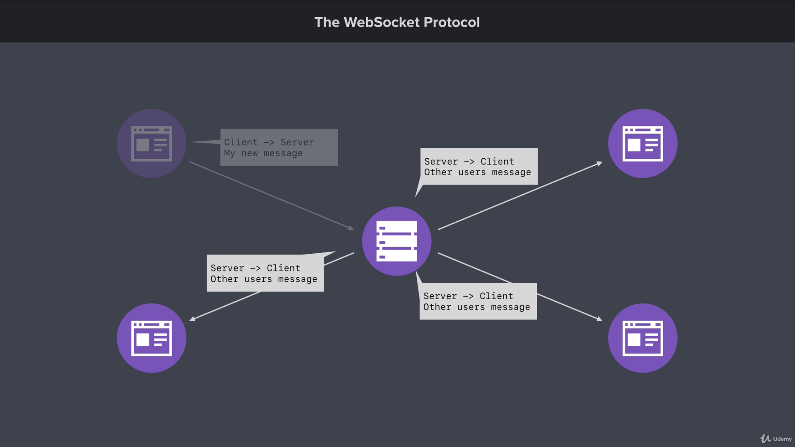

# Section Intro: Real-Time Web Applications with Socket.io

## 1: Section Intro: Real-Time Web Applications with Socket.io
Time to learn how to create real-time web applications with Node. The non- blocking nature of Node makes it well-suited for real-time applications such as chat apps, social media apps, and more.

## 2: Creating the Chat App Project
In this lesson it’s on you to set up the chat application web server.

The goal is to give you experience using what was covered in previous lessons. (You can check the web server project as guidance)

## 3. Web Sockets
The web socket protocol is used to create real time applications. Keep in mind that you can use web sockets with other programming languages as well. But in this case we will use the protocol with NodeJS to create a chat application.

Similar to HTTP, web socket protocol is going to allow us to setup communication between server and clients. So, the server start the application and from here clients will can connect with the server. I might have one client connect, or I might have several clients as well. In the next image you will see a scenario of one server and four clients with a list of the features that the web socket protocol offers us:


The first feature able with the web socket protocol is the **full duplex communication**. It is a fancy term for bi directional communication which means, that the client can initiate communication with the server and the server can initiate with the client. This is something that the HTTP protocol had not, because there the client is the only one who can initiate the communication, then the server responds. The server could not send data to the client if the client did not make a HTTP request before.

The second detail is that **web socket protocol is separate protocol from HTTP**. This means that the web socket protocol have different behaviors than HTTP.

The last feature is that we have **persistent connection** which means that all the clients connect to the server, and stays it connected for as long as it needs to.

To conclude this lesson, less show an example of a chat application in the next image:



In this case we start with a client active, and three clients in hold. First, we're going from client to the server and we're sending a new message across. So this particular user has typed something in the input field they've clicked the submit button to post the message to the chat room and that message goes from the client to the server. Now when the server gets the message it could do nothing. It could just print it to the terminal or do something else like dump it to a file on the file system. But what we really want to do is bring our other three clients into the mix. So the client has sent a message to the server.

The next thing we're gonna do is make sure that everyone else connected to that chatroom actually sees the message that this person typed. So right here we'll go ahead and bring those three clients into the mix. And this time we're also going to send some data around this time though it's going to go from the server to the client something we were not able to do in the past. So right here the server has said to this client I have a message from another user. It's going to send that message across to the client and the client can it in the browser the exact same thing is going to happen with our other two clients as well.

## 4. Getting Started with Socket.io
Time to setup the socket.io library. Socket.io comes with everything needed to set up a Web Socket server using Node.

### Socket.io on the Server
First up, install the modules

```
npm install socket.io@2.0.20
```

Socket.io can be used on its own or with Express. Since the chat app will serving up client-site assets, both Express and Socket.io will get set up. The server file below show how to get this done.

```js

const express = require('express');
const http = require('http');
const socketio = require('socket.io');
const path = require('path');

// Create the Express application
const app = express();

// Create the HTTP server using the Express application
const server = http.createServer(app);

// Connect Socket.io to the HTTP Server
const io = socketio(server);

const port = process.env.PORT || 3000;
const publicDirectoryPath = path.join(__dirname, '../public');

app.use(express.static(publicDirectoryPath));

// Listen for new connections to Socket.io
io.on('connection', () => {
    console.log('New web socket connection');
});

app.listen(port, () => {
    console.log('Server is up on port 3000');
});
```

The server above uses `io.on` which is provided by Socket.io. `on` allows the server to listen for an event and respond to it. In the example above, the server listens for `connection` which allows it to run some code when a client connects to the WebSocket server.

### Socket.io on the Client
Socket.io is also used on the client to connect to the server. Socket.io automatically serves up `/src/socket.io/socket.io.js` which contains the client-side code. The script tags below load in the client-side library followed by a custom JavaScript file.

```js
<script src="/socket.io/socket.io.js"></script>
<script src="/js/chat.js"></script>
```

You client-side JavaScript can the connect to the Socket.io server by calling `io`. `io` is provided by the client-side socket.io library. Calling this function will setup the connection, and it will cause the server `connection` event handler to run.

### Links
+ [https://socket.io/](Socket.io)

## 5. Socket.io Events
Time to learn how to work with events in Socket.io. Events allow you to transfer data from the client to the server.

### Working with Events
There are two side to every event, the sender and the receiver. If the server is the sender, then the client is the receiver, and vice versa. Events can be sent from the sender using `emit`. Events can be received by receiver using `on`. The example below shows how this pattern can be used to create a simple counter application. The following snippet contains the client-side JavaScript code.

```js
const socket = io();

// Listen the 'COUNT_UPDATED' event
socket.on('COUNT_UPDATED', (count) => {
    console.log('The count has been updated', count);
});

document.querySelector('#plus-one').addEventListener('click', () => {
    console.log('Clicked');
    // Listen the 'INCREMENT' event
    socket.emit('INCREMENT');
});
```

The client6 code uses `on` to listen for the `COUNT_UPDATED` event. A message will be logged with the current count when that event is received. The client-side code also uses `emit` to sen the `INCREMENT` event. This occurs when a button on the screen is clicked.

The server-side code for this example is below.

```js

let count = 0;

io.on('connection', () => {
    console.log('New web socket connection');
    socket.emit('COUNT_UPDATED', count);

    socket.on('COUNT_INCREMENTED', () => {
        count ++;
        // socket.emit('COUNT_UPDATED', count)
        io.emit('COUNT_UPDATED', count);
    });
});
```
The server above is responsible for emitting `COUNT_UPDATED` and listening for `INCREMENT`. New users get the current count right after they connect to the server. If a client sends `INCREMENT` to the server, the count is incremented and all connected clients are notified of the change.

On the client, `socket.emit` emits an event to the server. On the server, both `socket.emit` and `io.emit` can be used. `socket.emit` sends an event to that specific client, while `io.emit` sends an event to all connected clients.

## 6. Socket.io Events Challenge
To consolidate the explanation in the last lesson we will define two challenge:

### One: Event to send welcome message
Goal: Send a welcome message to new users

- Have server emit "message" when new clients connect
- Have client listen for "message" event and print the message to console
- Test your work

### Two: Event to send message between users
Goal: Allow clients to send message

- Create a form with and input and a button
- Setup event listener for form submissions
- Have server listen to the `SEND_MESSAGE` event
- Test your work

## 7. Broadcasting Events
## 8. Sharing Your Location
## 9. Event Acknowledgements
## 10. Form and Button States
## 11. Rendering Messages
## 12. Rendering Location Messages
## 13. Working With Time
## 14. Timestamps for Location Messages
## 15. Styling the Chat App
## 16. Join Page
## 17. Socket.io Rooms
## 18. Storing Users: Part I
## 19. Storing Users: Part II
## 20. Tracking Users Joining and Leaving
## 21. Sending Message to Rooms
## 22. Rendering User List
## 23. Automatic Scrolling
## 24. Deploying the Chat Application
